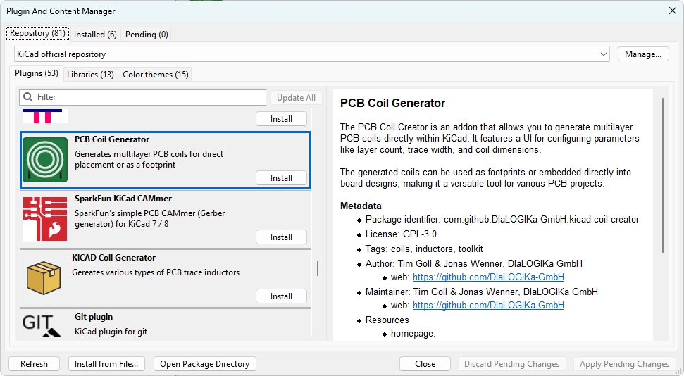
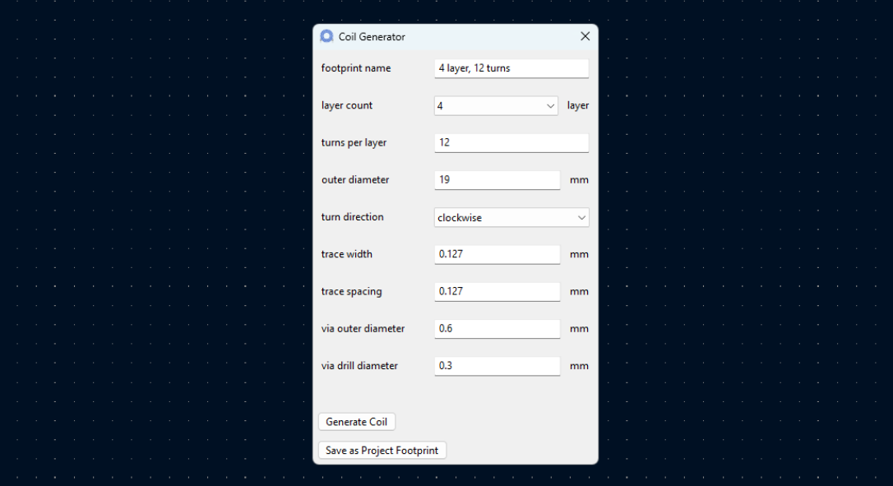
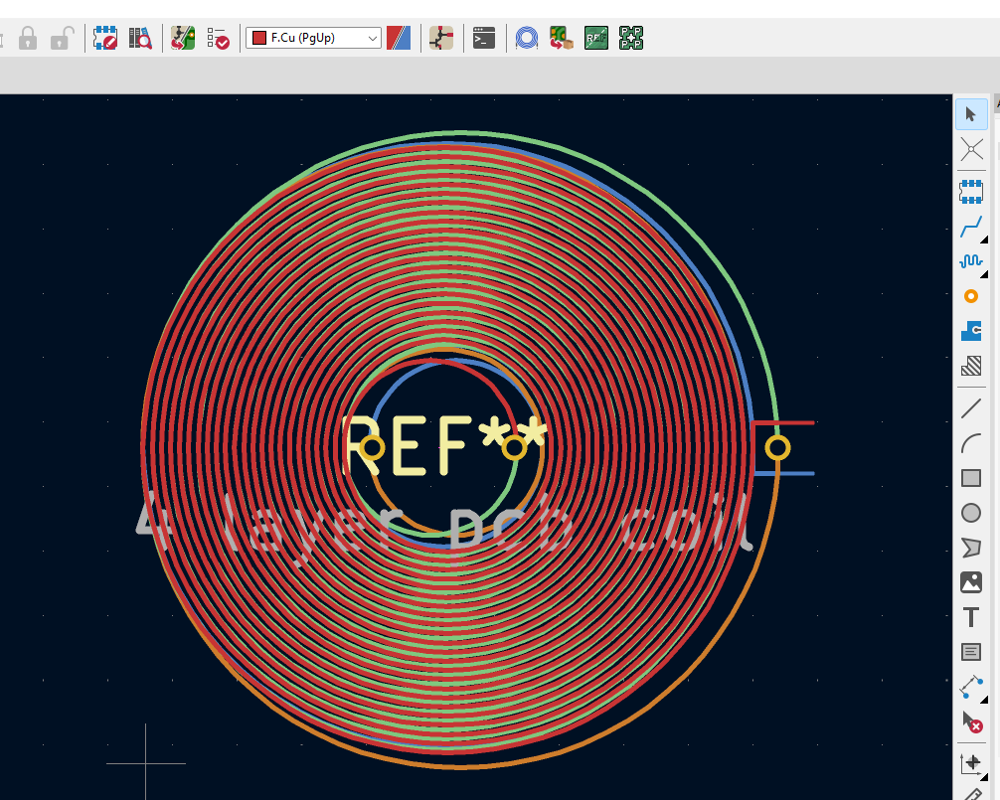
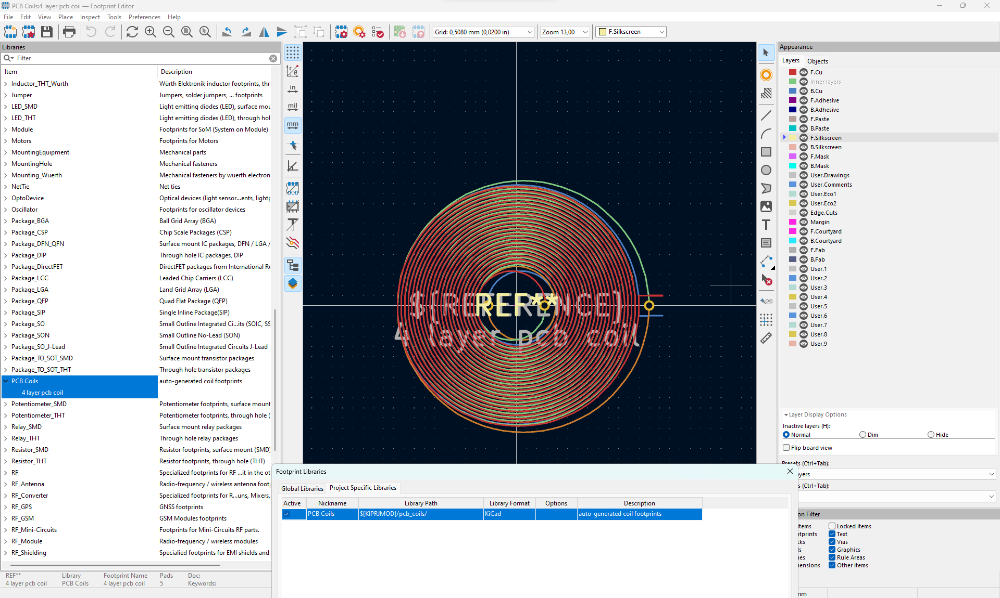

# PCB Coil Generator

## Features

1. Generate PCB coils and place them on the circuit board
1. Store these coils in a library so they can be assigned to a symbol

## Installation

### Official Installation

The _KiCad Coil Generator_ is included with the official "Plugin and Content Manager" from KiCad version 7 or newer.

### Manual Installation

Download the [latest release ZIP file](https://github.com/DIaLOGIKa-GmbH/kicad-coil-creator/releases). Open the "Plugin and Content Manager" from the KiCads main window and install the ZIP file via "Install from File".

### Development Setup

Clone the repository to your local machine. Add a symbolic link from the addon's `plugin` folder to `<user documents>/KiCad/<version>/3rdparty/plugins/`. You can rename the sym-linked `plugin` folder to your liking.

## Detailed Usage

This tool creates PCB coils that can be either directly inserted into the PCB itself, or exported as a footprint. The UI can be accessed from within the PCB editor:

_(The button for the UI is located within the addon section)_

This UI contains all relevant PCB coil settings to generate any desired coil.

### Generate Coil

By pressing the `Generate Coil` button, a new coil footprint is generated and inserted into the board. It can be moved freely but it has no schematic symbol attached to it. This makes it a bit tricky with netlists.

_(Generated coil inside the PCB editor)_

### Save as Project Footprint

Once a fitting coil has been generated, that coil can be stored on disk as a footprint. The coil generator creates a new footprint library in the project's folder named `PCB Coils` (`pcb_coils` on disk) that is automatically set as project library in the current project.

_(Footprint automatically exported can be viewed in the footprint editor)_

**Note:** KiCad sometimes does not detect the addition of a new library to the project. A restart of the program fixes that issue. _(It seems like this issue no longer exists in KiCad 8.0+)_

## Future Goals

- [ ] Add support for stretched coils
- [ ] Add support for rectangular coils
- [ ] Display coil statistics in the UI, [similar to TI's implementation](https://webench.ti.com/wb5/LDC)
  - Math: https://coil32.net/pcb-coil.html
  
## License

The **KiCad PCB Coil Generator** as a whole is licensed under the GNU General Public License, Version 3. See the [license](LICENSE).
